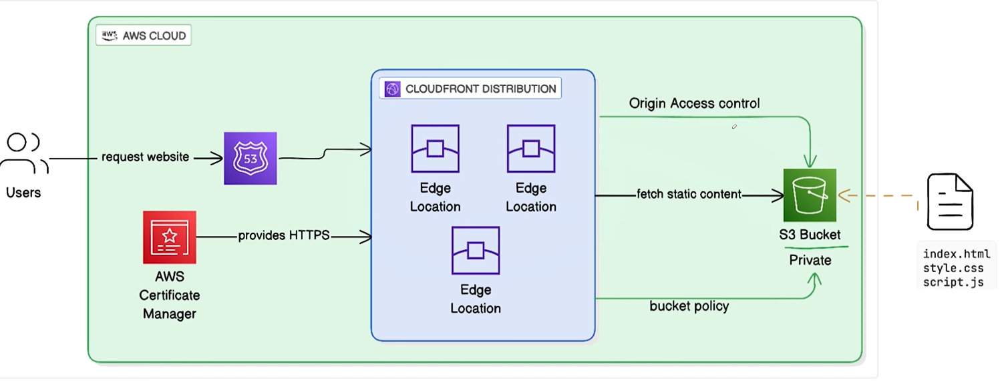

# Day 13: Static Website Hosting with S3, CloudFront, and OAC

This lab builds a secure static website delivery setup on AWS using OpenTofu.

The architecture keeps the S3 bucket private and serves the website through CloudFront. Users reach the site through the CloudFront distribution domain, and CloudFront reads static files from S3 through Origin Access Control.



## Architecture

- Users request the website through the CloudFront distribution domain.
- CloudFront serves cached content from edge locations.
- CloudFront uses Origin Access Control to securely fetch files from S3.
- The S3 bucket remains private and only allows access from the CloudFront distribution.
- Static website files such as `index.html`, `style.css`, and `script.js` are stored in S3.

## AWS Services Used

- Amazon S3
- Amazon CloudFront
- CloudFront Origin Access Control
- S3 bucket policy

## Project Goal

Create a production-style static website hosting stack where:

- The website is available through CloudFront.
- S3 public access stays blocked.
- CloudFront is the only public entry point.
- S3 content is protected using Origin Access Control.

## Expected Files

The static website content should include:

```text
index.html
style.css
script.js
```

The OpenTofu configuration will typically include:

```text
providers.tf
variables.tf
main.tf
outputs.tf
backend.tf
```

## Implementation Steps

1. Create a private S3 bucket for website files.
2. Upload the static website files to the bucket.
3. Block all public access on the S3 bucket.
4. Create a CloudFront Origin Access Control.
5. Create a CloudFront distribution with the S3 bucket as the origin.
6. Add an S3 bucket policy that allows only the CloudFront distribution to read objects.
7. Validate the website through the CloudFront distribution domain.

## Important Notes

- The S3 bucket should not be configured for public static website hosting when using OAC.
- Use the S3 REST endpoint as the CloudFront origin, not the S3 website endpoint.
- CloudFront deployment can take several minutes after changes.

## Example Variables

```hcl
bucket_name = "example-static-site"
tags = {
  Project = "opentofu-day13"
  Managed = "opentofu"
}
```

## Common Commands

Initialize the working directory:

```bash
tofu init
```

Review the planned infrastructure changes:

```bash
tofu plan
```

Apply the configuration:

```bash
tofu apply
```

Destroy the resources when the lab is complete:

```bash
tofu destroy
```

## Validation

After deployment, verify:

- The CloudFront distribution status is `Deployed`.
- Direct public access to the S3 bucket is blocked.
- Website files are served only through CloudFront.

## Cleanup

Before destroying the infrastructure, make sure the S3 bucket is empty. S3 buckets with objects cannot be deleted unless the configuration explicitly handles object cleanup.
